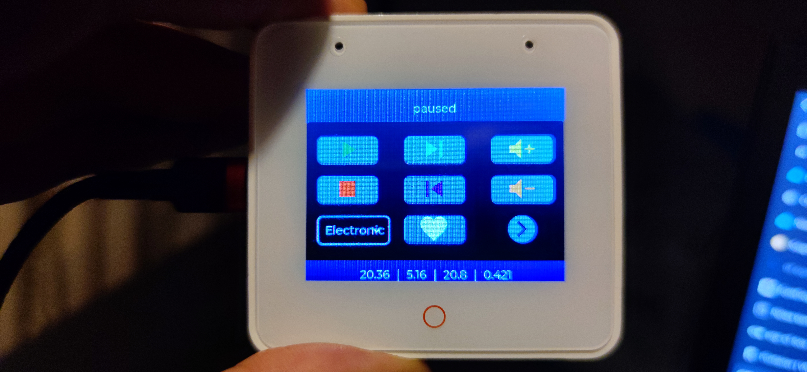

# ESP-S3 Box Player with Navidrome and Home Assistant Integration

This project integrates an ESP32-S3 Box with Navidrome and Home Assistant to create a music player with a touchscreen interface. It allows users to control playback, select playlists, and monitor media player states.

## Prerequisites:
- **No transcoding** for a player in navidrome - if transcoding is enabled, code and HA is not able to read current song position.
- **Pyscript Integration** has to be installed.


## Features

- **Playlist Management**: Load and play playlists from Navidrome.
- **Playback Control**: Play, stop, skip to the next/previous song, and adjust volume.
- **Touchscreen Interface**: Control playback and select playlists directly from the ESP32-S3 Box touchscreen.
- **Home Assistant Integration**: Synchronize media player states and control additional devices.
- **ESP S3 Box**: Is not required you may use services to start and control playlists. 

---

## Components

### 1. Python Script: `service-navidrome-playlist.py`

This script handles the interaction with the Navidrome API and manages the playback queue.

#### Key Features:
- Fetches songs from a Navidrome playlist and shuffles them.
- Controls playback (start, stop, next, previous).
 - Provides a service to select playlists by name.
- Logs playback events for debugging.

#### Services:
- `start_queue(playlist_id)`: Starts playback of the specified playlist.
- `stop_queue()`: Stops playback.
- `next_queue_song()`: Skips to the next song in the queue.
- `previous_queue_song()`: Returns to the previous song in the queue.
- `navidrome_select_playlist()`: Retrieves playlists from Navidrome, optionally filtering by name.
- `navidrome_add_to_favorite()`: Add curently playing song to Favourites

---

### 2. ESPHome Configuration: `esp-s3-box-playa.yaml`

This configuration sets up the ESP32-S3 Box with a touchscreen interface for controlling playback.

#### Key Features:

- **Hardware Buttons**:
  - Top left button - adjustable switch entity (toggle)
  - Home button - adjustable brightness (4 varius levels)

- **Touchscreen Buttons**:
  - Play, Stop, Next, Previous, Volume Up, Volume Down, Add to Favourite.
  - Dropdown menu for playlist selection.
- **Display**:
  - Shows current song title, artist, and playback status.
  - Displays sensor data at the bottom of the screen.
- **Home Assistant Integration**:
  - Mirrors media player state and controls additional devices (e.g., switches, sensors).

#### Substitutions:
- `playlists_text`: Display names of playlists.
- `player_name`: Home Assistant media player entity.
- `switch_1` and `switch_2`: Additional switches for toggling devices.
- `sensor_1` to `sensor_4`: Sensors displayed on the screen.

#### Globals:
- `playlist_options`: Stores playlist names and IDs.
- `selected_playlist_id`: Tracks the currently selected playlist.

#### Fonts:
- Custom fonts for text and icons.

#### API and OTA:
- Enables remote updates and API communication.

---

## Setup Instructions

### 1. Python Script

1. Configure the script:
   - Set `NAVIDROME_URL`, `USER`, and `PASSWORD` in `service-navidrome-playlist.py`.
2. Deploy the script to your Home Assistant `pyscript` directory.

### 2. ESPHome Configuration
1. Update the `esp-s3-box-playa.yaml` file:
   - Replace `static_ip`, `gateway`, and `dns1` with your network configuration.
   - Set `wifi_ssid` and `wifi_password` in your ESPHome secrets file.
   - Update `playlists_text` and `playlist_options` with your Navidrome playlists.
2. Flash the configuration to your ESP32-S3 Box.

---

## Usage

### Touchscreen Controls
- **Play**: Starts playback of the selected playlist.
- **Stop**: Stops playback.
- **Next/Previous**: Skips to the next or previous song.
- **Volume Up/Down**: Adjusts the volume.
- **Dropdown Menu**: Selects a playlist.

### Home Assistant
- Use the `pyscript` services to control playback:
  - `pyscript.start_queue`
  - `pyscript.stop_queue`
  - `pyscript.next_queue_song`
  - `pyscript.previous_queue_song`
  - `pyscript.navidrome_select_playlist`

---

## Example Interface

Below is an example of the ESP32-S3 Box interface:

- screen_2.jpg — playlist selection / dropdown view
- screen_1.jpg — playback details and controls (current position, duration, song metadata and optional sensor values)




---

## Example Playlist Configuration

In esp-s3-box-playa.yaml update the user-facing playlist names in the substitutions block (order matters because the code maps the selected index to the ID list):

Example playlists in substitutions (keep order):
```yaml
# filepath: c:\Users\micha\Downloads\REPOZYTORIA\esp-s3-box-player-navidrome-hass\ESPHome\esp-s3-box-playa.yaml
substitutions:
  playlists_text:
    - Zywe 138Up
    - Electronic 128Up
    - Samochodowa
    - Sorround
    - Ulubione
    - Sweta
```

Where to add the playlist IDs (mapping name -> Navidrome ID)
- The firmware initializes the playlist ID list inside the dropdown's on_value lambda using id(playlist_options).push_back("Name|ID").
- Edit the push_back entries inside esp-s3-box-playa.yaml (search for id(playlist_options).push_back) and ensure the push_back order exactly matches playlists_text order.

Example (already present in esp-s3-box-playa.yaml):
```yaml
# inside dropdown on_value lambda (esp-s3-box-playa.yaml)
id(playlist_options).push_back("Zywe 138Up|iL0sqVKwqdFFGZoebHKyoj");
id(playlist_options).push_back("Electronic 128Up|zdNJt3oxktNg2PlDZN0il7");
id(playlist_options).push_back("Samochodowa|13452774-17c4-42e5-a15b-ef816b8bcb9d");
id(playlist_options).push_back("Sorround|db5b3414-ca58-4560-a50b-0268366be8f2");
id(playlist_options).push_back("Ulubione|50fe70a3-77b6-40e8-bd3e-2fc1e834038b");
id(playlist_options).push_back("Sweta|1c59c757-778e-4d02-99da-7bfed7a33e2e");
```

Notes:
- Do not rely on line numbers; search for the push_back lines in the YAML and keep their order in sync with playlists_text.
- The selected playlist ID is stored in the global id(selected_playlist_id) and passed to the pyscript.start_queue service.

--- 

## Configuring sensors and switches

Your esp-s3-box-playa.yaml uses substitution keys for switches and sensors. Update these substitutions with correct Home Assistant entity ids and types.

Key substitution patterns used by the YAML:
- player_name — used as the media player base name; code uses media_player.${player_name} (so supply only the media player name part used in HA).
- switch_button_left — entity name (switch) mapped to the top-left hardware button.
- switch_N and switch_N_type — both are required for page‑2 buttons. The code calls the HA service ${switch_N_type}.toggle and uses entity_id: ${switch_N_type}.${switch_N}. Example:
  - switch_1: radio_gniazdko
  - switch_1_type: switch
  - Resulting service call: switch.radio_gniazdko toggle
- switch_N_icon — specify an icon glyph (unicode escape) that exists in the icon font list (see icon glyphs in the YAML).
- sensor_1..sensor_4 — sensors for page 1 bottom status.
- sensor_1_page_2..sensor_4_page_2 — sensors displayed on page 2 bottom status.

Example substitutions (adapt these values to your environment):
```yaml
# filepath: c:\Users\micha\Downloads\REPOZYTORIA\esp-s3-box-player-navidrome-hass\ESPHome\esp-s3-box-playa.yaml
substitutions:
  player_name: home_player
  switch_button_left: komputer_gniazdko

  switch_1: radio_gniazdko
  switch_1_type: switch
  switch_1_text: "Głoś."
  switch_1_icon: "\U000F04C3"

  switch_2: sony_kd_65xf9005
  switch_2_type: media_player
  switch_2_text: "TV"
  switch_2_icon: "\U000F0839"

  # sensors
  sensor_1: czujnik_sypialnia_temperature
  sensor_2: czujnik_zewnatrz_temperature
  sensor_3: czujnik_gabinet_temperature
  sensor_4: licznik_pradu_aktualny_pobor

  sensor_1_page_2: pge_naleznosc
  sensor_2_page_2: pgnig_gaz_rachunek
  sensor_3_page_2: dhw1_system_pressure
  sensor_4_page_2: czujnik_gabinet_atmospheric_pressure
```

Icons and glyphs
- The YAML loads an icon font (materialdesignicons-webfont). To change an icon, set switch_N_icon to the proper unicode codepoint in the substitutions.
- Ensure the icon glyph is included in the font glyphs block in the YAML; the YAML contains many pre-added icon glyphs — if you add new ones, add the codepoint to the icon glyphs list.

--- 

## Brightness and Home Button behavior

- The display brightness is controlled by the global id(current_brightness) (initial_value: 28).
- The home button cycles brightness in steps (adds 20 and wraps to 25 when over 100).
- On boot the firmware sets the backlight relative brightness: on_boot triggers light.dim_relative with relative_brightness: 72% (edit this in the esp-s3-box-playa.yaml on_boot block).
- To change startup brightness, adjust globals -> selected initial_value for current_brightness and/or modify the on_boot relative_brightness value.

--- 

## Add-to-favorites button

- The on-screen heart button calls the Home Assistant service pyscript.navidrome_add_to_favorite — ensure the pyscript contains that service implementation.

--- 

## Troubleshooting tips (extras)

- If sensors show "unknown" or empty, verify entity IDs in Home Assistant Developer Tools -> States.
- For switches not responding, check that the type (switch / fan / media_player / script) matches the entity and that the entity id is correct.
- To find the playlist ID for Navidrome, use the Navidrome API or UI and add it to the push_back list as Name|ID.

---

## Troubleshooting

- **Playback Issues**: Check the logs in Home Assistant for errors.
- **Touchscreen Not Responding**: Verify the `i2c` and `touchscreen` configuration in `esp-s3-box-playa.yaml`.
- **Network Issues**: Ensure the ESP32-S3 Box is connected to the correct Wi-Fi network.

---

## Configuring the 8 page‑2 switches (detailed)

This project exposes eight configurable buttons on "page 2". Each switch uses a pair of substitutions: the entity name (switch_N) and the entity type (switch_N_type). Additional substitutions control displayed text and the icon glyph.

What to set for each switch:
- switch_N — the entity id name part (without the domain). Example: radio_gniazdko
- switch_N_type — the Home Assistant domain/type (switch, fan, light, script, etc.). The YAML issues a service call ${switch_N_type}.toggle by default.
- switch_N_text — short label shown next to the icon.
- switch_N_icon — unicode codepoint glyph shown from the icon_font (set to a value present in the icon glyphs list).

Example substitutions (copy into the substitutions block in esp-s3-box-playa.yaml and edit to your entities):
```yaml
# filepath: c:\Users\micha\Downloads\REPOZYTORIA\esp-s3-box-player-navidrome-hass\ESPHome\esp-s3-box-playa.yaml
substitutions:
  # page 2 switches (all eight)
  switch_1: radio_gniazdko
  switch_1_type: switch
  switch_1_text: "Głoś."
  switch_1_icon: "\U000F04C3"

  switch_2: sony_kd_65xf9005
  switch_2_type: media_player    # see note below
  switch_2_text: "TV"
  switch_2_icon: "\U000F0839"

  switch_3: wentylator_garaz
  switch_3_type: fan
  switch_3_text: "Garaż"
  switch_3_icon: "\U000F001B"

  switch_4: gniazdko_kamera_garaz
  switch_4_type: switch
  switch_4_text: "Garaż"
  switch_4_icon: "\U000F07AE"

  switch_5: gniazdko_kamera_salon
  switch_5_type: switch
  switch_5_text: "Salon"
  switch_5_icon: "\U000F07AE"

  switch_6: gniazdko_kamera_kuchnia
  switch_6_type: switch
  switch_6_text: "Kuchn."
  switch_6_icon: "\U000F07AE"

  switch_7: podgrzanie_wody_na_zadanie
  switch_7_type: script
  switch_7_text: "CWU"
  switch_7_icon: "\U000F0F92"

  switch_8: "1664627371595"
  switch_8_type: script
  switch_8_text: "Garaz"
  switch_8_icon: "\U000F12D3"
```

Notes and tips:
- `switch_8_icon` please remeber toi add value to the list on line 800+
- The YAML calls the service ${switch_N_type}.toggle by default. Use domain types that implement .toggle (switch, light, fan, input_boolean). If your target entity (for example media_player) does not support toggle, set switch_N_type to script and create a Home Assistant script that performs the desired action (e.g., media_player.media_play_pause or custom behavior). Then set switch_N to the script entity id.
- Icons: set switch_N_icon to a unicode codepoint present in the icon font glyphs block. If you add new icons, also add their codepoints to the icon glyphs list under font -> icon_font_55 in esp-s3-box-playa.yaml.
- Label text: switch_N_text is the short label shown next to the icon. Keep labels short to fit UI layout.
- Status color feedback: the YAML includes text_sensor mappings (switch_1_sensor .. switch_8_sensor). These mirror the entity state and update the icon color (yellow when "on", black when "off"). No additional config required beyond correct substitution values.
- Entity id formatting: the template used in the YAML builds entity_id as `${switch_N_type}.${switch_N}`. Example: switch.radio_gniazdko. If you prefer full entity ids or an unusual domain, map via a script substitution or use switch_N_type=script and create helper scripts in HA.
- If you want different behavior than .toggle (e.g., turn_on / turn_off or custom service), replace the on_release homeassistant.service block in esp-s3-box-playa.yaml accordingly.

Where the buttons appear:
- The 8 switches are placed in a 3x3 grid on page 2 (see esp-s3-box-playa.yaml page "audio_player_page_two"). The last cell is a navigation button that returns to page 1.

Quick validation checklist:
- Update substitutions in esp-s3-box-playa.yaml.
- Confirm each entity exists in Home Assistant Developer Tools -> States.
- If an entity does not support .toggle, create a small script in HA and set switch_N_type: script and switch_N to that script id.
- Rebuild and flash ESPHome firmware; verify icons and labels display and tapping a button triggers the expected HA service.

--- 

## Troubleshooting

- **Playback Issues**: Check the logs in Home Assistant for errors.
- **Touchscreen Not Responding**: Verify the `i2c` and `touchscreen` configuration in `esp-s3-box-playa.yaml`.
- **Network Issues**: Ensure the ESP32-S3 Box is connected to the correct Wi-Fi network.

---


